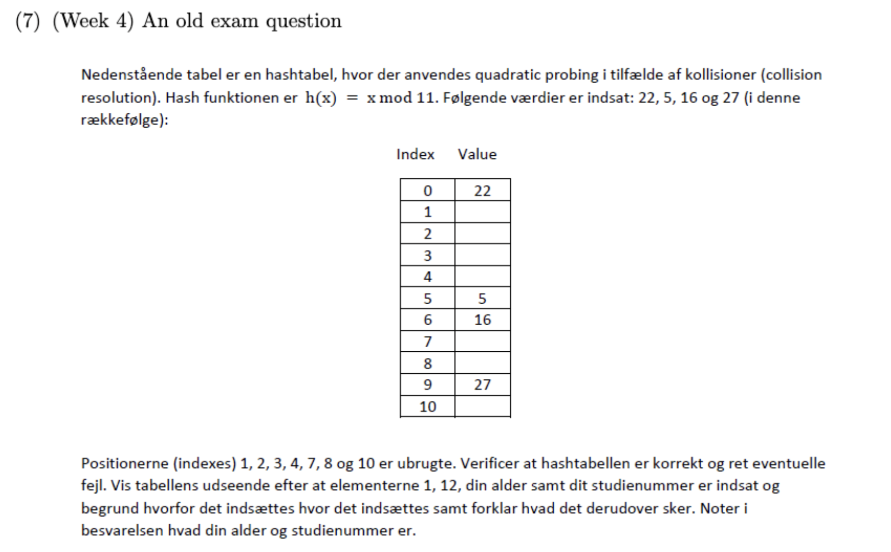

# Exercise 1

```cpp
#pragma once

#include <cassert>
#include "simple_list.h"

template <typename Object>
class LinkedList : public List<Object> {
private:
    struct Node {
        Object data;
        Node *next;
    };

    int theSize;
    Node *head;
    Node *tail;

public:
    LinkedList() {
        theSize = 0;
        head = new Node;
        tail = new Node;
        head->next = tail;
        tail->next = nullptr;
    }

    ~LinkedList() {
        clear();
        delete head;
        delete tail;
    }

    int size() const override  { return theSize; }
    bool empty() const override { return (size() == 0); }

    void clear() override{
        Node *p = head->next;
        while (p != tail) {
            Node *t = p->next;
            delete p;
            p = t;
        }
        head->next = tail;
        theSize = 0;
    }

    void push_front(const Object& x) override {
        Node *p = new Node;
        p->data = x;
        p->next = head->next;
        head->next = p;
        theSize++;
    }

    void push_back(const Object& x) override {
        
        Node *last = head;
        while (last->next != tail) {
            last = last->next;
        }
        Node *p = new Node;
        p->data = x;
        p->next = tail;
        last->next = p;
        theSize++;
    }

    Object pop_front() override {
        Node *p = head->next;
        Object x = p->data;
        head->next = p->next;
        theSize--;
        delete p;
        return x;
    }

    Object pop_back() override{
        assert(theSize > 0);
        if (theSize == 1) {
            return pop_front();
        }
        assert(theSize >= 2);
        Node *second_to_last = head;
        while (second_to_last->next->next != tail) {
            second_to_last = second_to_last->next;
        }
        Node *last = second_to_last->next;
        Object x = last->data;
        second_to_last->next = tail;
        theSize--;
        delete last;
        return x;
    }

    Object find_kth (int pos) const override{
        assert(pos >= 0 && pos < theSize);
        Node *p = head->next;
        while (pos > 0) {
            p = p->next;
            pos--;
        }
        return p->data;
    }

    Object remove(int pos){
        assert(pos >= 0 && pos < theSize);
        Node *p = head;
        while (pos > 0) {
            p = p->next;
            pos--;
        }
        Node *q = p->next;
        Object x = q->data;
        p->next = q->next;
        theSize--;
        delete q;
        return x;
    }

    void insert (const Object &x, int pos){
        assert(pos >= 0 && pos <= theSize);
        Node *p = head;
        while (pos > 0) {
            p = p->next;
            pos--;
        }
        Node *newNode = new Node;
        newNode->data = x;
        newNode->next = p->next;
        p->next = newNode;
        theSize++;
    }

    bool contains(const Object &x) const{
        Node *p = head->next;
        while (p != tail) {
            if(p->data == x){
                return true;
            }
            p = p ->next;
        }
        return false;
    }

    void print() const{
        Node *p = head->next;
        while (p != tail){
            std::cout << "Data: " << p->data << std::endl;
            p = p->next;
        }
    }

    void reverse() {
    Node* prev = tail; 
    Node* curr = head->next; 
    while (curr != tail) {
        Node* next = curr->next; 
        curr->next = prev;
        prev = curr;
        curr = next;
    }
    head->next = prev;
}
};


int main() {
    LinkedList<int> testlist;

    std::cout << "LIST TEST" << std::endl;

    // Test push_front og push_back
    testlist.push_front(3);   // Liste: 3
    testlist.push_back(5);    // Liste: 3 5
    testlist.push_front(1);   // Liste: 1 3 5

    std::cout << "Efter push_front og push_back:" << std::endl;
    testlist.print();

    // Test size og empty
    std::cout << "Size: " << testlist.size() << std::endl;
    std::cout << "Is empty? " << (testlist.empty() ? "yes" : "no") << std::endl;

    // Test insert i midten
    testlist.insert(7, 2); // Indsæt 7 på plads 2: Liste: 1 3 7 5
    std::cout << "Efter insert(7,2):" << std::endl;
    testlist.print();

    // Test contains
    std::cout << "Contains 3? " << (testlist.contains(3) ? "yes" : "no") << std::endl;
    std::cout << "Contains 8? " << (testlist.contains(8) ? "yes" : "no") << std::endl;

    // Test find_kth
    std::cout << "Element på plads 2: " << testlist.find_kth(2) << std::endl;

    // Test pop_front og pop_back
    int popped_front = testlist.pop_front();
    std::cout << "Efter pop_front (" << popped_front << "):" << std::endl;
    testlist.print();

    int popped_back = testlist.pop_back();
    std::cout << "Efter pop_back (" << popped_back << "):" << std::endl;
    testlist.print();

    // Test remove
    int removed = testlist.remove(1); // burde nu være [3,7], fjerner 7
    std::cout << "Efter remove(1) (" << removed << "):" << std::endl;
    testlist.print();

    // Test reverse
    testlist.push_front(11);
    testlist.push_back(42);
    std::cout << "Før reverse: " << std::endl;
    testlist.print();

    testlist.reverse();
    std::cout << "Efter reverse:" << std::endl;
    testlist.print();

    // Test clear
    testlist.clear();
    std::cout << "Efter clear:" << std::endl;
    testlist.print();
    std::cout << "Is empty? " << (testlist.empty() ? "yes" : "no") << std::endl;

    return 0;
}


```

# Exercise 2

```cpp

#ifndef _ARRAY_STACK_H_
#define _ARRAY_STACK_H_

template <typename Object>
class ArrayStack {
private:
    Object* arr;      
    int capacity;     
    int topIndex;     

public:
    
    ArrayStack(int initSize = 100)
        : arr(new Object[initSize]), capacity(initSize), topIndex(-1) {}

    ~ArrayStack() { delete[] arr; }

    bool empty() const {
        return topIndex == -1;
    }

    Object top() const {
        if (empty()) throw std::out_of_range("Stack is empty!");
        return arr[topIndex];
    }

    Object pop() {
        if (empty()) throw std::out_of_range("Stack is empty!");
        return arr[topIndex--];
    }

    
    void push(const Object& x) {
        if (topIndex + 1 == capacity) { 
            int newCapacity = capacity * 2;
            Object* newArr = new Object[newCapacity];
            for (int i = 0; i <= topIndex; ++i) {
                newArr[i] = arr[i];
            }
            delete[] arr;
            arr = newArr;
            capacity = newCapacity;
        }
        arr[++topIndex] = x;
    }
};

#endif

```

## Analyse the running time of the stack operations push() and pop() in terms of the N elements it stores:

The pop-operation is always O(1).

The push-operation is normally O(1), but in the case that the array has to be doubled in size, it will be O(N), since the whole array will have to copied element by element.


# Exercise 3

```cpp

#ifndef _QUEUE_WITH_STACKS_H_
#define _QUEUE_WITH_STACKS_H_

#include "stack_class.h" 

template <typename Object>
class QueueWithStacks {
private:
    Stack<Object> inbox;
    Stack<Object> outbox;

public:
    QueueWithStacks() {}

    bool empty() {
        return inbox.empty() && outbox.empty();
    }

    void put(const Object& x) {
        inbox.push(x); 
    }

    
    Object front() {
        if (outbox.empty()) {
            while (!inbox.empty()) {
                outbox.push(inbox.pop());
            }
        }
       
        return outbox.top();
    }

    
    Object get() {
        if (outbox.empty()) {
            while (!inbox.empty()) {
                outbox.push(inbox.pop());
            }
        }
        return outbox.pop();
    }
};

#endif


```


# Exercise 4

## (a) Chaining

| Index| Value  |
|-----------|-------------------------|
| 0         |           28              |
| 1         |           15             |
| 2         |                         |
| 3         |            17 -> 10             |
| 4         |                         |
| 5         |           5 -> 19  -> 33 -> 12     |
| 6         |            20             |

---

## (b) Linear Probing 

We rehash the table to size 17 (the next prime above 2x7). All existing keys are reinserted using the new hash function h(x) = x % 17

| Index | Value     |
|-----------|---------|
| 0         |    17     |
| 1         |        |
| 2         |   19   |
| 3         |     20    |
| 4         |         |
| 5         |    5     |
| 6         |         |
| 7         |         |
| 8         |       |
| 9         |      |
| 10        |   10  |
| 11        |     28    |
| 12        |     12    |
| 13        |         |
| 14        |    |
| 15        |     15    |
| 16        |    33     |


---

## (c) Quadratic Probing 

| Index | Value     |
|-----------|---------|
| 0         |    28     |
| 1         |    15   |
| 2         |      |
| 3         |     17    |
| 4         |     10    |
| 5         |    5     |
| 6         |    19    |
| 7         |    20   |
| 8         |       |
| 9         |    33 |
| 10        |     |
| 11        |         |
| 12        |         |
| 13        |         |
| 14        |  12  |
| 15        |         |
| 16        |         |

---

## Calculation of load-factor (λ):

*Chaining:*  
$λ = 9/7 = 1,2857$

*Linear probing:*  
$λ = 9/17 = 0.5294117647$

*Quadratic probing:*  
$λ = 9/17 = 0.5294117647$

# Exercise 5

```cpp

#ifndef _SIMPLE_SET_H_
#define _SIMPLE_SET_H_

#include "simple_linked_list.h" 

template <typename Object>
class SimpleSet {
private:
    LinkedList<Object>* list; 

public:
    SimpleSet() { list = new SimpleLinkedList<Object>(); }
    ~SimpleSet() { delete list; }

   
    void insert(const Object& x) {
        if (!contains(x)) {
            list->push_front(x); 
        }
    }

    
    bool contains(const Object& x) const {
        return list->contains(x); 
    }

   
   void remove(const Object& x) {
    int n = list->size();
    for (int i = 0; i < n; i++) {
        if (list->find_kth(i) == x) {
            list->remove(i);
            break;
        }
    }
}
};

#endif

```


# Exercise 6

```cpp

#include <vector>
#include <utility>
#include <iostream>

template<typename KeyType, typename ValueType>
class Dictionary {
private:
    std::vector<std::pair<KeyType, ValueType>> data;

public:
   
    void insert(const KeyType& key, const ValueType& value) {

        for (auto& pair : data) {
            if (pair.first == key) {
                pair.second = value;
                return;
            }
        }
     
        data.emplace_back(key, value);
    }


    void remove(const KeyType& key) {
        for (auto it = data.begin(); it != data.end(); ++it) {
            if (it->first == key) {
                data.erase(it);
                return;
            }
        }
    }

    bool contains(const KeyType& key) const {
        for (const auto& pair : data) {
            if (pair.first == key)
                return true;
        }
        return false;
    }


    ValueType get(const KeyType& key) const {
        for (const auto& pair : data) {
            if (pair.first == key)
                return pair.second;
        }
        throw std::out_of_range("Key not found.");
    }


    size_t size() const {
        return data.size();
    }


    bool isEmpty() const {
        return data.empty();
    }
    void display() const {
        for (const auto& pair : data) {
            std::cout << "(" << pair.first << ", " << pair.second << ")\n";
        }
    }
};

```


# Exercise 7




We start by verifying that the numbers are correctly inserted:

22 % 11 = 0 (Correctly inserted)

5 % 11 = 5 (Correctly inserted)

16 % 11 = 5. Since index number 5 is taken, we have to go to the next available index using quadatric probing. 5 + 1^2 = 6 (Correctly inserted)

27% 11 = 5. Since index number 5 and index 6 is taken, we have to go to the next available index using quadatric probing. 5 + 2^2 = 9 (Correctly inserted)


My age is 29 and my study number is 202308201

We now insert the numbers 1, 12, 29 and 202308201.

1 % 11 = 1.

12 % 11 = 1. Since index 1 is taken, we go to the next using quadatric probing. 1+1^2 = 2.

29% 11 = 8.

202308201 % 11 = 1. Since index 1 and 2 is taken, we go to the next using quadatric probing. 1+2^2 = 5. We see that this index is also taken, so we go the next index (1+3^2 = 10)

Therefore the final hashtable will look as below: 


| Index | Value     |
|-----------|---------|
| 0         |   22     |
| 1         |    1    |
| 2         |    12  |
| 3         |        |
| 4         |         |
| 5         |    5     |
| 6         |     16    |
| 7         |         |
| 8         |    29   |
| 9         |    27  |
| 10        |    202308201 |
