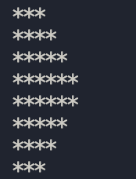
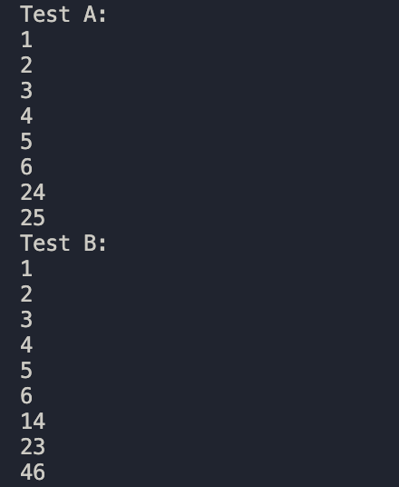

# Exercise 1

```cpp
#include <iostream>

bool contains(int *A, int x, int size)
{

    if (*A == x)
    {
        return true;
    }

    else if (size == 0)
    {
        return false;
    }

    return contains(A + 1, x, size - 1);
}

int findMax(int *array, int size){
    if (size == 1){
        return *array;
    }
    int MaxOfRest = findMax(array+1,size-1);
    return (*array > MaxOfRest) ? *array : MaxOfRest;


}

int findMin(int*array, int size){
    if (size == 1){
        return *array;
    }
    int MinOfRest = findMin(array+1,size-1);
    return (*array < MinOfRest) ? *array : MinOfRest;


}
int main()
{

    int array[]{1, 2, 3, 4, 5, 6, 7, 8, 9, 10};

    int size = sizeof(array) / sizeof(array[0]);

    std::cout << "1.A: " << std::endl;

    std::cout << contains(array, 8, size) << std::endl;  // Outputs 1 for true
    std::cout << contains(array, 12, size) << std::endl; // Outputs 0 for false


    std::cout << "1.B" << std::endl;

    std::cout << findMax(array,size) << std::endl; // Outputs 10
    std::cout << findMin(array,size) << std::endl; // Outputs 1

    return 0;
}

```

Worst case time complexity for 1.A:

In the worst case, the algorithm checks every element of the array exactly once, resulting in O(N) time complexity for an array of N elements.

Worst case time complexity for 2.A:

In the worst case, the algorithm checks every element of the array exactly once, resulting in O(N) time complexity for an array of N elements.

# Exercise 2

```cpp

#include <iostream>

void triangle(int m, int n){
    if (m > n){
    return;
    }
    else {
        for (int i = 0; i < m; i++){
            std::cout << "*";
        }
        std::cout << std::endl;
        triangle(m+1,n);
        for (int i = 0; i < m; i++){
            std::cout << "*";
        }
        std::cout << std::endl;
    }
}

int main() {


    triangle(3,6);
    return 0;
}

```

Output:



# Exercise 3

```cpp

#include <iostream>

void bookletPrint(int startpage, int endpage, int originalStartpage){

    if(startpage > endpage){
        return;
    }
    std::cout << "Sheet " << (startpage-originalStartpage)/2+1 << " contains pages: " << startpage << ", " << startpage+1 << ", " << endpage-1 << ", " << endpage << std::endl;
    bookletPrint(startpage+2,endpage-2,originalStartpage);

}


int main() {

    bookletPrint(5,12,5);

    return 0;
}
```

# Exercise 4

```cpp
#include <iostream>

bool solve_maze(char maze[5][6],char checked_maze[5][6], int y, int x){
    if (maze[y][x] == 'X' || checked_maze[y][x] == 'X' ){
        return false;
    }
    else if (maze[y][x] == 'E'){
        return true;
    }

    checked_maze[y][x] = 'X';

    if(solve_maze(maze,checked_maze, y-1, x)){ //Checks field above
        return true;
    }
      if(solve_maze(maze,checked_maze, y, x+1)){ //Checks field to the right
        return true;
    }
     if(solve_maze(maze,checked_maze, y+1, x)){ //Checks field below
        return true;
    }
    if(solve_maze(maze,checked_maze, y, x-1)){ //Checks field to the left
        return true;
    }

    return false;
    }


int main() {


    char maze[5][6] = {
    {'X', 'X', 'X', 'X', 'X', 'X'},
    {'X', ' ', ' ', ' ', ' ', 'X'},
    {'X', ' ', 'X', 'X', ' ', 'X'},
    {'X', ' ', 'X', 'E', ' ', 'X'},
    {'X', 'X', 'X', 'X', 'X', 'X'}
};

char checked_maze[5][6] = {
    {' ', ' ', ' ', ' ', ' ', ' '},
    {' ', ' ', ' ', ' ', ' ', ' '},
    {' ', ' ', ' ', ' ', ' ', ' '},
    {' ', ' ', ' ', ' ', ' ', ' '},
    {' ', ' ', ' ', ' ', ' ', ' '}
};

std::cout << solve_maze(maze,checked_maze,1,1) << std::endl; //Output = 1

    return 0;
}
```

# Exercise 5

Recursion recipe:

1. State problem in terms of it's size / complexity

   Given a linked list, find the position (index) of a node whose data equals x. The size/complexity is determined by the number of nodes left to inspect in the list.

2. Find Base Case of problem and show how it can be solved without recursion

   Base case for the search:

   If the current node is null, meaning the end of the list, then x is not in the list: return -1.
   If the current node's data matches x, we have found the element: return the current position (index).

3. Based on the inductive hypothesis (or recursive leap of faith), find the recursive case of the problem and show how it can be solved using recursion that makes progress towards the base case

   If we are not at the end (and have not found x), assume we can find x in the rest of the list by recursively calling search on the next node, incrementing the position.

   If the recursive call finds x further in the list, return that position.
   Otherwise, return -1.

4. Ensure that the recursive case makes progress towards and eventually reaches the BC

   In each recursive call, we move one node forward (node->next) and increment the position — this means we are always progressing towards either finding x or reaching the end (null), so we are guaranteed to reach the base case eventually.

```cpp

#pragma once

#include <cassert>
#include "simple_list.h"

template <typename Object>
class LinkedList : public List<Object> {
private:
    struct Node {
        Object data;
        Node *next;
    };

    int theSize;
    Node *head;
    Node *tail;

public:
    LinkedList() {
        theSize = 0;
        head = new Node;
        tail = new Node;
        head->next = tail;
        tail->next = nullptr;
    }

    ~LinkedList() {
        clear();
        delete head;
        delete tail;
    }

    int size() const override  { return theSize; }
    bool empty() const override { return (size() == 0); }

    void clear() override{
        Node *p = head->next;
        while (p != tail) {
            Node *t = p->next;
            delete p;
            p = t;
        }
        head->next = tail;
        theSize = 0;
    }

    void push_front(const Object& x) override {
        Node *p = new Node;
        p->data = x;
        p->next = head->next;
        head->next = p;
        theSize++;
    }

    void push_back(const Object& x) override {

        Node *last = head;
        while (last->next != tail) {
            last = last->next;
        }
        Node *p = new Node;
        p->data = x;
        p->next = tail;
        last->next = p;
        theSize++;
    }

    Object pop_front() override {
        Node *p = head->next;
        Object x = p->data;
        head->next = p->next;
        theSize--;
        delete p;
        return x;
    }

    Object pop_back() override{
        assert(theSize > 0);
        if (theSize == 1) {
            return pop_front();
        }
        assert(theSize >= 2);
        Node *second_to_last = head;
        while (second_to_last->next->next != tail) {
            second_to_last = second_to_last->next;
        }
        Node *last = second_to_last->next;
        Object x = last->data;
        second_to_last->next = tail;
        theSize--;
        delete last;
        return x;
    }

    Object find_kth (int pos) const override{
        assert(pos >= 0 && pos < theSize);
        Node *p = head->next;
        while (pos > 0) {
            p = p->next;
            pos--;
        }
        return p->data;
    }

    Object remove(int pos){
        assert(pos >= 0 && pos < theSize);
        Node *p = head;
        while (pos > 0) {
            p = p->next;
            pos--;
        }
        Node *q = p->next;
        Object x = q->data;
        p->next = q->next;
        theSize--;
        delete q;
        return x;
    }

    void insert (const Object &x, int pos){
        assert(pos >= 0 && pos <= theSize);
        Node *p = head;
        while (pos > 0) {
            p = p->next;
            pos--;
        }
        Node *newNode = new Node;
        newNode->data = x;
        newNode->next = p->next;
        p->next = newNode;
        theSize++;
    }

    bool contains(const Object &x) const{
        Node *p = head->next;
        while (p != tail) {
            if(p->data == x){
                return true;
            }
            p = p ->next;
        }
        return false;
    }

    void print() const{
        Node *p = head->next;
        while (p != tail){
            std::cout << "Data: " << p->data << std::endl;
            p = p->next;
        }
    }

    void reverse() {
    Node* prev = tail;
    Node* curr = head->next;
    while (curr != tail) {
        Node* next = curr->next;
        curr->next = prev;
        prev = curr;
        curr = next;
    }
    head->next = prev;
}


    int search(const Object x) {
    return search_helper(x, head->next, 0);
    }

    int search_helper(const Object x, Node* curr, int pos) {
    if (curr == tail)
        return -1;
    if (curr->data == x)
        return pos;
    return search_helper(x, curr->next, pos+1);
    }


};


#include <iostream>
#include <simple_linked_list.h>


int main() {

   LinkedList<int> testlist;


    // Test push_front and push_back
    testlist.push_back(1); // List: 1
    testlist.push_back(3);  // List: 1 3
    testlist.push_back(5); // List: 1 3 5
    testlist.push_back(7);  // List: 1 3 5 7

    std::cout << testlist.search(5) << std::endl; //Output = 2
    std::cout << testlist.search(10) << std::endl; //Output = -1


    return 0;
}
```

# Exercise 6


```cpp

void selectionSort(vector<int>& a) {
  for (int i = 0; i < a.size(); i++) {
    int minIndex = i;

    for (int j = i + 1; j < a.size(); j++) {
      if (a[j] < a[minIndex]) {
        minIndex = j;
      }
    }

    // Swap a[i] med det mindste element
    int temp = a[i];
    a[i] = a[minIndex];
    a[minIndex] = temp;
  }
}

int main() {
  vector<int> A {1, 4, 2, 3, 6, 5,20,25};

  vector<int> B {6, 5, 4, 3, 2, 1,14,23,46};

  

  selectionSort(A);
  selectionSort(B);

  std::cout << "Test A:" << std::endl;

  for (int i = 0; i < A.size(); i++) {
    cout << A[i] << endl;
  }

  std::cout << "Test B:" << std::endl;

  for (int i = 0; i < B.size(); i++) {
    cout << B[i] << endl;
  }

  return 0;
}

```

Output: 

Tidskompleksitet er O(n²) for både best case og worst case — den indre løkke kører altid fuldt ud, uanset om arrayet allerede er sorteret.

# Exercise 7

```cpp
#include <iostream>
#include <vector>

using namespace std;

vector<int> countingSort(const vector<int>& input, int k) {
    vector<int> count(k + 1, 0);
    vector<int> output(input.size());

   
    for (int i = 0; i < input.size(); i++) {
        count[input[i]] = count[input[i]] + 1;
    }

   
    for (int i = 1; i <= k; i++) {
        count[i] = count[i] + count[i - 1];
    }

    
    for (int i = input.size() - 1; i >= 0; i--) {
        int j = input[i];
        count[j] = count[j] - 1;
        output[count[j]] = input[i];
    }

    return output;
}

int main() {
    vector<int> A {8,2,1,6};

    vector<int> sorted = countingSort(A, 8); // Output [1,2,6,8]

    for (int i = 0; i < sorted.size(); i++) {
        cout << sorted[i] << " ";
    }
    cout << endl; 

    return 0;
}

```

Tidskompleksitet: Counting sort har tidskompleksitet med O(n+k), hvis k er større end n, hvilket er worst case. Hvis k er lig med eller mindre end n, så er tidskompleksiteten O(n), hvilket er best case. 

Space complexity:  Vi skal allokerer 2 arrays, et output array med størrelse n og et count-array med størrelse k+1. Derfor bliver space complexiteten O(n+k). Her er worst case = base case.


Chattens:

Tidskompleksitet: Counting sort har tidskompleksitet O(n+k), hvor n er antal elementer og k er den største værdi. Algoritmen udfører altid det samme arbejde uanset input. Når k ≤ n dominerer n, og det forenkles til O(n). Når k >> n dominerer k, og algoritmen bliver ineffektiv.

Space complexity: Vi allokerer 2 arrays, et output array med størrelse n og et count-array med størrelse k+1. Derfor er space complexity altid O(n+k), da begge arrays allokeres uanset input.


# Exercise 8


```cpp

#ifndef _QUICK_SORT_H_
#define _QUICK_SORT_H_

#include <vector>
#include <cassert>
#include "insertion_sort.h"
using namespace std;


const int useInsertion = 16; // Value to decide when to go from quick-sort into insertion-sort.

template <typename Comparable>
int partition(vector<Comparable>& a, int left, int right) {
	int center = (left + right) / 2;

	if (a[center] < a[left])
		std::swap(a[left], a[center]);
	if (a[right] < a[left])
		std::swap(a[left], a[right]);
	if (a[right] < a[center])
		std::swap(a[center], a[right]);

	// Place pivot at position right - 1
	std::swap(a[center], a[right - 1]);

	// Now the partitioning
	Comparable& pivot = a[right - 1];
	int i = left, j = right - 1;
	do {
		while (a[++i] < pivot);
		while (pivot < a[--j]);
		if (i < j) {
			std::swap(a[i], a[j]);
		}
	} while (i < j);

	std::swap(a[i], a[right - 1]);	// Restore pivot
	return i;
}


template <typename Comparable>
void quickSort(vector<Comparable>& a, int left, int right) {


	assert(left >= 0 && right < (int)a.size());

	if (right-left+1 > useInsertion) {
		int i = partition(a, left, right);
		quickSort(a, left, i - 1);
		quickSort(a, i + 1, right);
	} else {
		insertionSort(a.begin() + left, a.begin()+right+1);
	}
}


#include <iostream>
#include <vector>
#include <chrono>
#include <algorithm>
#include "quick_sort.h"

using namespace std;
using namespace std::chrono;

vector<int> generateRandom(int size) { //Generates a random number to fill our vector with.
    vector<int> v(size);
    auto f = []() -> int { return rand() % 1000000; };
    generate(v.begin(), v.end(), f);
    return v;
}

int main() {
    vector<int> sizes = {100, 1000, 10000, 100000};

    cout << "Testing our IntroSort (useInsertion = " << useInsertion << ")" << endl;

    for (int size : sizes) {
        vector<int> v = generateRandom(size);

        auto start = high_resolution_clock::now();
        quickSort(v);
        auto stop = high_resolution_clock::now();

        auto duration = duration_cast<microseconds>(stop - start);
        cout << "N = " << size << " \t Time: " << duration.count() << " microseconds" << endl;
    }

    cout << endl;
    cout << "Testing std::sort " << endl;

    for (int size : sizes) {
        vector<int> v = generateRandom(size);

        auto start = high_resolution_clock::now();
        sort(v.begin(), v.end());
        auto stop = high_resolution_clock::now();

        auto duration = duration_cast<microseconds>(stop - start);
        cout << "N = " << size << " \t Time: " << duration.count() << " microseconds" << endl;
    }

    return 0;
}


```
Output from test, using different UseInsertion values:

Testing our IntroSort (useInsertion = 4)
N = 100          Time: 28 microseconds
N = 1000         Time: 183 microseconds
N = 10000        Time: 2022 microseconds
N = 100000       Time: 23999 microseconds

Testing std::sort 
N = 100          Time: 4 microseconds
N = 1000         Time: 26 microseconds
N = 10000        Time: 274 microseconds
N = 100000       Time: 3177 microseconds


Testing our IntroSort (useInsertion = 16)
N = 100          Time: 16 microseconds
N = 1000         Time: 193 microseconds
N = 10000        Time: 2367 microseconds
N = 100000       Time: 25954 microseconds

Testing std::sort 
N = 100          Time: 4 microseconds
N = 1000         Time: 26 microseconds
N = 10000        Time: 273 microseconds
N = 100000       Time: 3111 microseconds


Testing our IntroSort (useInsertion = 32)
N = 100          Time: 24 microseconds
N = 1000         Time: 269 microseconds
N = 10000        Time: 3049 microseconds
N = 100000       Time: 33335 microseconds

Testing std::sort 
N = 100          Time: 4 microseconds
N = 1000         Time: 26 microseconds
N = 10000        Time: 273 microseconds
N = 100000       Time: 3098 microseconds


Testing our IntroSort (useInsertion = 64)
N = 100          Time: 27 microseconds
N = 1000         Time: 377 microseconds
N = 10000        Time: 4357 microseconds
N = 100000       Time: 52564 microseconds

Testing std::sort 
N = 100          Time: 4 microseconds
N = 1000         Time: 29 microseconds
N = 10000        Time: 309 microseconds
N = 100000       Time: 3520 microseconds


We can see that our IntroSort performs best when UseImplement = 16, but UseImplement = 4 is right behind it. When we set UseImplement equals to 32 and 64, the performance drops dramatically as InsertionSort starts to dominate with its slower O(N^2). 

std::sort is faster because it is a mature, heavily optimized implementation with additional optimizations like heapSort fallback and better pivot selection.
